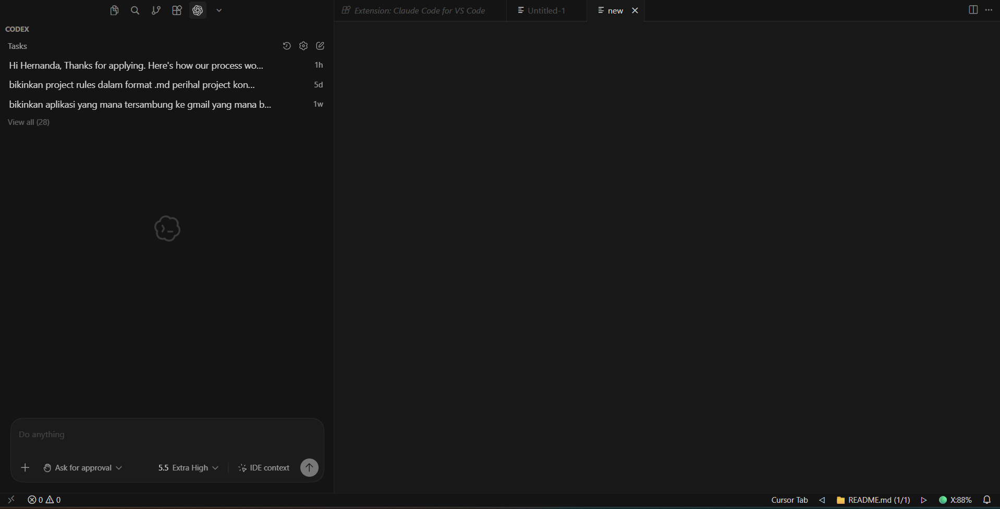

# YouTube Content Strategy for B2B SaaS

This repository is a research collection for a future playbook on how B2B SaaS companies can use YouTube to build trust, capture search demand, repurpose expertise, and support pipeline.

## What I Collected

- 10 expert source profiles in `research/sources.md`
- 10 LinkedIn/public post logs in `research/linkedin-posts/`
- 12 YouTube transcript-derived research notes in `research/youtube-transcripts/`
- Additional podcast, article, and collection-method notes in `research/other/`

I used Codex with web search, `youtube-transcript-api`, YouTube RSS/metadata checks, and manual public-source review. Full raw transcripts are not copied into the repo; instead, each YouTube file records transcript retrieval metadata and summarizes the strategic takeaways.

## Why These Experts

The expert list focuses on people who actively practice B2B/SaaS video, YouTube, podcast, or content distribution strategy:

- Samu Kovacs: B2B YouTube agency/operator with 40+ active B2B YouTube channels.
- Sam Dunning: Breaking B2B founder connecting SEO/AEO, YouTube, and LinkedIn to SaaS pipeline.
- Ali Schwanke: built HubSpot Hacks with Simple Strat into a niche B2B software education channel.
- Alli Tunell: Grizzle strategist publishing tactical B2B SaaS YouTube guidance.
- Tom Whatley: Grizzle founder with recent SaaS YouTube research and video production frameworks.
- Hansel Alvarez: operator building YouTube channels for B2B SaaS companies.
- Jamie Whiffen: YouTube strategist focused on packaging, returning viewers, and audience psychology.
- Lee Glynn: B2B YouTube consultant focused on channel audits, trust, and conversion.
- Justin Simon: Distribution First founder focused on repurposing and content distribution systems.
- James Carbary: Sweet Fish founder treating video podcasts as B2B content engines.

This mix gives the later playbook coverage across strategy, topic research, packaging, production, repurposing, distribution, and measurement.

## Repository Structure

```text
research/
  sources.md
  linkedin-posts/
  youtube-transcripts/
  other/
assets/
  codex-login-proof.png
```

## Collection Notes

YouTube captions were retrieved through `youtube-transcript-api` where available. Later requests hit YouTube IP protection, so those fetch failures are documented in `research/other/transcript-fetch-log.md` and supplemented with public podcast/LinkedIn/source pages.

LinkedIn posts were collected manually from public pages discovered through search. Each author file includes source URLs, observed public date labels, summaries, and playbook relevance.

## Setup Context

This repository started as the 100Hires AI tools setup portfolio project. The original setup proof is still included below.


